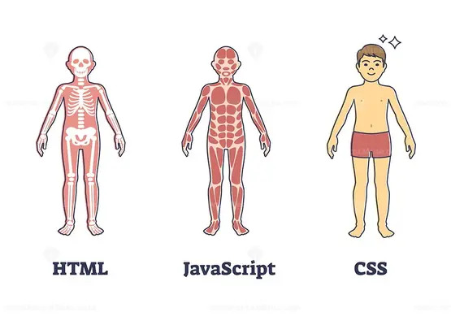

# Week 3 #

## What are your thoughts about the roles HTML, CSS, and JavaScript play in the process of rendering content and providing a user experience? ##

I think about HTML, CSS, and Javascipt's roles like the those of different parts of the human body. HTML is like the skeleton, it holds everything up and gives it structure. There are a lot of different bones (tags), but overall, it isn't overly complicated and is straight forward. 

I think about CSS as the skin. It makes the body pretty (or handsome) and makes it unique. It's mostly cosmetic but has some ability to add interactivity. 

I think about Javascript as the muscles of the of body. It adds a lot of movement and true activity. It receives inputs and produces outputs. It's powerful, as you don't have to refresh the get things to work.

## What are some objects that your blog incorporates? ##

I didn't incorporate any objects into my blog. Objects and arrays are really powerful, but I am still playing with them. I am currently playing with a layout I really enjoy, but am not really to deploy it. Eventually my blog will be incorporated into it.
