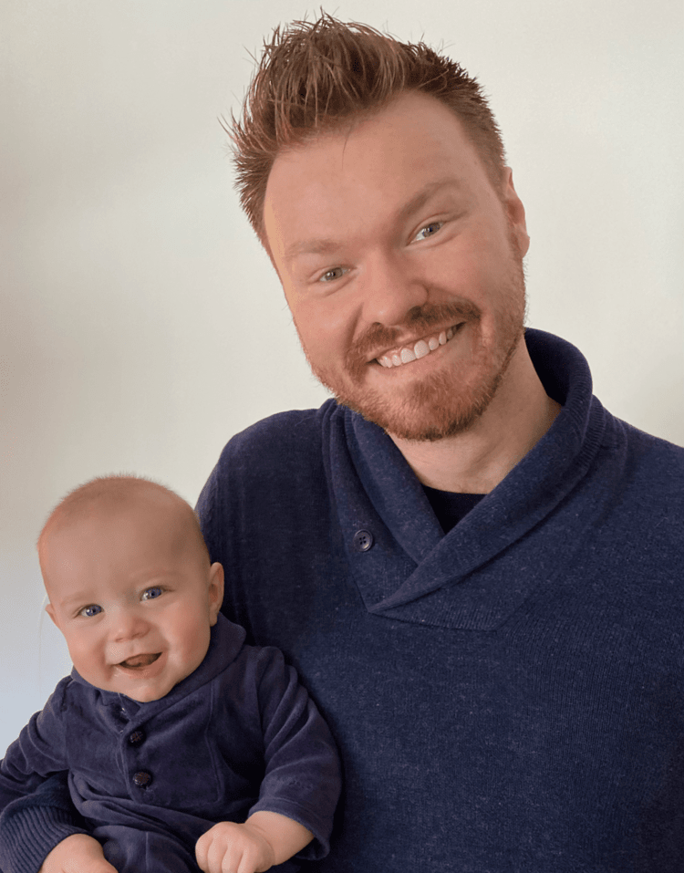

# Cody's Super Awesome Blog #

## Was your first week what you expected? Why? Why not? ##

> "High achievement *always* takes place in the framework of high expectation." -Charles Kettering

That is a **great** question. A lot of people say that having expections leads to disappointment. I disagree. I think having expectations sets you up for success. There were things I was expecintg and things I wasnt. This cohort is no different.  

#### What I was expecting ####

The cohort of diverse backgrounds and people. Some people think that coders are just young guys nerding out in a basement. But that has never been my impression. I knew that coding attracts many different people from many different walks of life. From the single mom looking to have a more balanced work-home life, to the young entrepreneur looking to be spotlighted by Forbes 30 under 30. This cohort is no different, bringing bright and talented peolpe from all walks of life.

#### What I wasn't expecting ####

That getting git would be so hard. I have done some coding before and thought I knew my way around. Boy was I wrong. I am getting a hang out it now, but it was a ***very*** rough start. 

I also didnt expect the Awesome Inc. building to be so large and maze like. I've driven past the building every single day for the past two years and even did a virtual tour of it. However, when I went home after the onboarding process, I had to weave and wind through hallway after hallway just to find the exit. It was kind of fun and reminded me of how solving code can sometimes feel like working through a maze. 

## What are you excited or eager to learn more about? ##

I am excited and eager to learn everything; From HTML to Python. I am excited to see if I enjoy backend versus frontend, or if I will like them equally. I suspect I will like backend more, but only time will tell. I am most eager to learn Python, because of my iterest in AI.

## What is something about you that can only be learned by reading this blog? ##

Here are somethings that you wouldn't know about me except by reading the blog:

Married | 8 years|
|---|---|
|Fav. Animal| Fox|
Fav. Color | Orange... Because I love Foxes
Fav. Metal | Copper... because it reminds me of Foxes
